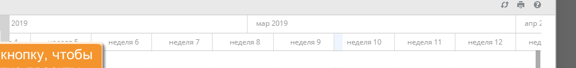
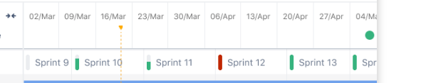
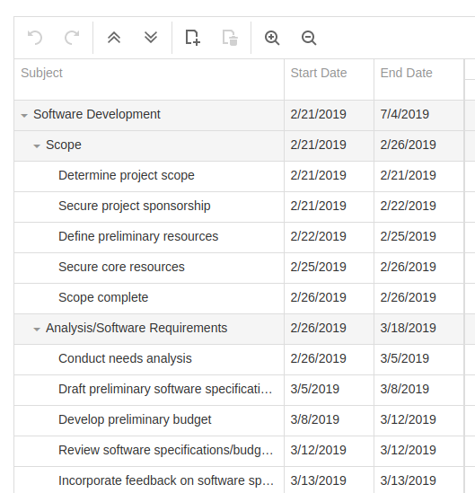
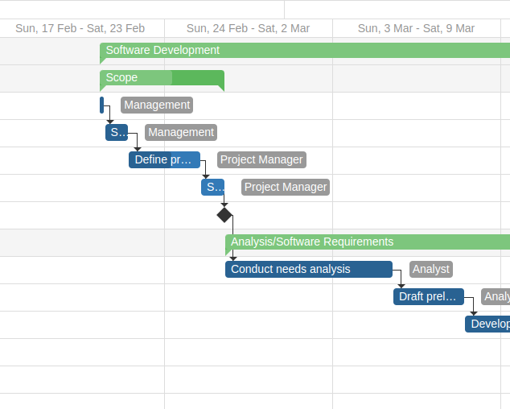

# Диаграмма Ганта

## Что это?
- [Общая статья Atlassian про Gantt](https://www.atlassian.com/ru/agile/project-management/gantt-chart)

## Примеры реализаций

- Пример из [OnlyOffice](https://helpcenter.onlyoffice.com/ru/userguides/groups-guides-projects-gantt-chart.aspx)
- [Инструмент в JIRA](https://www.atlassian.com/ru/software/jira/features/roadmaps)
- Виджет в платной js библиотеке [devextreme](https://js.devexpress.com/Demos/WidgetsGallery/Demo/Gantt/Overview/jQuery/Light/)
  - Необфусцированный код диаграмыы (но не исходный) можно получить через `yarn install devextreme`
- Что такое спринт? - в различных методологиях используется термин "Спринт" - временные промежутки на которые планируются задачи (обычно неделя или две недели)

## Постановка задачи

Разработать конфигурируемый виджет диаграммы Ганта на [typescript](https://www.typescriptlang.org/).
Конфигурация виджета описана в файле [`gantt-options.ts`](gantt/models/gantt-options.ts)

Задачу предлагается решить последовательно разработав набор виджетов.

\\* Дополнительные задачи можно не реализовывать, их реализация предполагается в дальнейшем, но не является обязательной в рамках летней практики

### Общая логика работы с виджетами

- все виджеты должны реализовывать интерфейс `WidgetRenderer`
- метод `render` должен возвращать `DOM` элемент виджета
- обновлять параметры виджета через метод `update` (после вызова должен обновиться dom виджета)
- корневой виджет - [`GanttWidget`](./gantt/index.ts)
- конфигурация виджета - [`GanttOptions`](./gantt/models/gantt-options.ts)
- в методе `init` передается список табличных данных для отображения

### Виджет временной шкалы (таймлайн) для диаграммы Ганта

- Конфигурация шкалы описана в файле [`gantt-hierarchy.ts`](./gantt-timeline/gantt-timeline-options.ts)
- Временная шкала предоставляет пользователю навигацию в временном пространстве
- Отображает текущий временной интервал (в поле видимости) и разделяет его на временные промежутки (в большинстве случаев равные), например, "день" или "месяц"
- При изменении масштаба виджет должен плавно сокращать временной интервал (время начала увеличивается, время окончания уменьшается) относительно текущего положения курсора
  - Масштаб изменяется скроллом средней кнопкой мыши
  - При изменении масштаба увеличивается размер делений/промежутков `Sub Interval`
  - При достижении определенной ширины, которая задана в конфигурации `Gantt Hierarchy` должен сменяться на следующий `AggregationLevel` указанный в конфигурации
  - В рамках задачи реализовать уровни
    - день
    - `Sprint`
    - месяц
    - квартал
    - год
- тоа
- При скролле влево/вправо сдвигать интервал по временной шкале не меняя его ширины
  - Скролл горизонтальным колесом мыши или зажатием лкм (перетягиванием)
  - Горизонтальный виртуальный скроллинг - `DOM` дерево обновляется, не увеличивается в размерах при горизонтальной навигации
- Для упрощения работы дата везде задается через тип `number`, количество [мс](https://developer.mozilla.org/en-US/docs/Web/JavaScript/Reference/Global_Objects/Date/now)
- Для работы с датами можно использовать библиотеку [`date-fns`](https://date-fns.org/), но желательно не включать её в код ядра библиотеки (лучше как подключаемый модуль для читабельного отображения дат)

#### Дополнительные задачи

- Фиксированные уровни агрегации (возможность закрепить на нижнем уровне спринт, как это сделано в JIRA)

### Таблица

- В левой части диаграммы отображать таблицу событий
- Конфигурация находится в файле [`GanttTableOptions`](./gantt-table/gantt-table-options.ts)
- `render` - метод для отрисовки ячейки столбца, в рамках задачи использовать метод по-умолчанию, которые отображает значение поля указанного в `systemName`
- На первом этапе можно ограничиться тем, что поддерживается только фиксированная высота строк

#### Дополнительные задачи
- Изменять размер таблицы по ширине перекрывая область с временной шкалой (не сдвигая!)
- Подумать, как синхронизировать правую и левую часть виджета при динамическом размере строк таблицы
- Иерархия в левой панели, скрывать/показывать группы строк
- Изменение ширины столбцов
- Рендерер заголовка таблицы, объединение ячеек в заголовке таблицы

### Секта и отрисовка событий

- Виджет отображения временной сетки, масштабируемый в соответствии с временной шкалой диаграммы Ганта
- Отображать виджеты событий в соответствующих временных точках (на первоначальном этапе достаточно простого блока с текстом)
- По аналогии с другими виджетами добавить папку и typescript интерфейс
- Для отрисовки отдельного события в конфигурации должен быть передан соответствующий метод `render` заданного типа [gantt-event-renderer.ts](gantt/models/gantt-event-renderer.ts)

#### Дополнительные задачи
- Отображать текущий день и возможность визуализации других временных маркеров
- Возможность перемещать события через `drag drop`
- Возможность создать событие на таймлайне

### Установка связей
- Возможность провести направленную связь между двумя событиями
- У виджета события отрисовываются два элемента-маркера (начало и конец). Кликнув на этот элемент можно провести линию к другому событию, закончив движение в входном маркере другого события
  - смотреть пример у `devextreme`
- Отрисовка связей должна быть реализована в виджете сетки
- Логика инициализации связей должна находиться в методе `init`
- По аналогии с другими виджетами добавить папку и typescript интерфейс для конфигурации
- Метод отрисовки связи по аналогии должен быть передан в конфигурацию для возможности смены алгоритма отрисовки связей

#### Дополнительные задачи
- Возможность удалить связь
- Возможность перемещать события через `drag drop`

### Общие дополнительные задачи
- вертикальный виртуальный скроллинг
  - отображать данные порционно, в `DOM` должно находиться ограниченное число строк
- Отображать процесс загрузки данных
- `cypress` тесты

## DEV workflow

- используется пакетный менеджер `yarn` (`npm i -g yarn`)
- сборщик `webpack`
- версия `node` 16.13.2 или `nvm`
- инициализация
  - `nvm use` (опционально, если используете менеджер версий для nodejs)
  - `yarn install`
- запуск приложения в режиме разработки `yarn start`
- запуск линтера `yarn lint`

- точки входа в приложение `index.ts` и `style.css`, `index.html`

